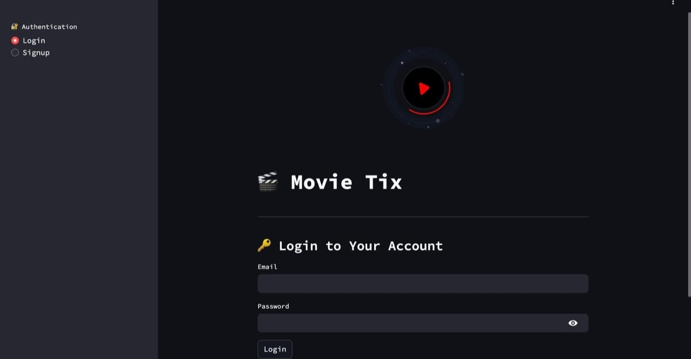
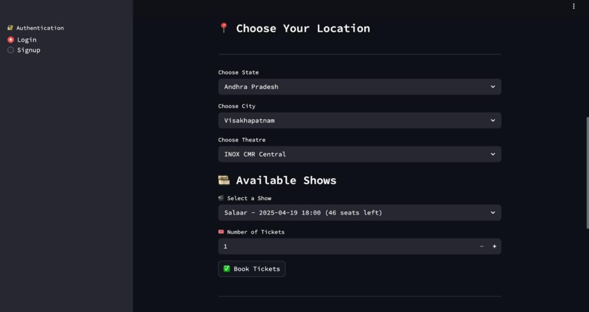

# 🎟️ Movie Ticket Booking Application

A full-stack movie ticket booking web app, allowing users to browse movies, check showtimes, and book tickets — similar to BookMyShow.

## 🌐 Live Demo

👉 [Click here to view the live website](https://movietix-dhaf.onrender.com/)

## 🛠️ Tech Stack

- **Frontend**: HTML, CSS, JavaScript
- **Backend**: Node.js, Express.js
- **Database**: MongoDB / Oracle SQL (as applicable)
- **Deployment**: Render

## 🔑 Features

- 🎬 View available movies and showtimes
- 🪑 Seat selection and ticket booking
- 📄 Booking confirmation page
- 📧 Email notifications (if implemented)
- 🔐 Optional: User authentication and login

## 🧪 How to Run Locally

1. **Clone the repository**:
   ```bash
   git clone https://github.com/rakeshreddy59/Movie-Ticket-Booking-Application.git
   cd Movie-Ticket-Booking-Application

2. **Install dependencies**:
    npm install

3. **Start the development server**:
    npm start

4. **Open your browser and go to**:
    [http://localhost:3000](http://localhost:3000)

## 📁 Folder Structure

```plaintext
ticket_booking_web/
├── assets/               # Static files (images, icons, etc.)
├── venv/                 # Virtual environment (excluded in Git)
├── *.py                  # Python modules (main, auth, booking, etc.)
├── movie_booking.db      # SQLite database
├── requirements.txt      # Python dependencies
├── README.md             # Project documentation
├── schema.sql            # SQL schema (DB structure)
├── screenshots/          # Images used in README


## 🖼️ Screenshots

### 🏠 Homepage


### 🎟️ Seat Selection


### ✅ Booking Confirmation

